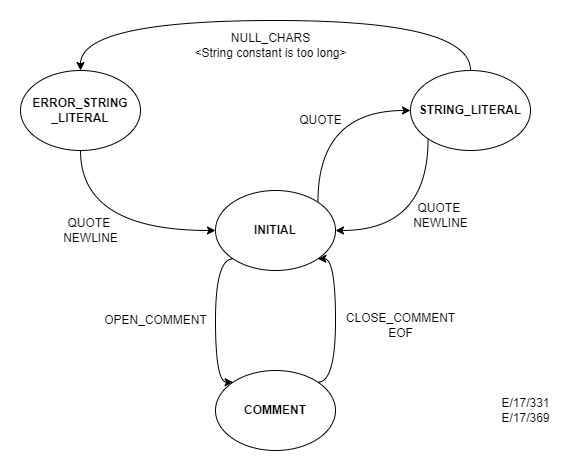

README file for Programming Assignment 2 (C++ edition)
=====================================================

Your directory should contain the following files:

 Makefile
 README
 cool.flex
 test.cl
 lextest.cc      -> [cool root]/src/PA2/lextest.cc
 mycoolc         -> [cool root]/PA2/mycoolc
 stringtab.cc    -> [cool root]/PA2/stringtab.cc
 utilities.cc    -> [cool root]/PA2/utilities.cc
 handle_flags.cc -> [cool root]/PA2/handle_flags.cc
 *.d             dependency files
 *.*             other generated files

The include (.h) files for this assignment can be found in 
[cool root]/PA2

	The Makefile contains targets for compiling and running your
	program. DO NOT MODIFY.

	The README contains this info. Part of the assignment is to fill
	the README with the write-up for your project. You should
	explain design decisions, explain why your code is correct, and
	why your test cases are adequate. It is part of the assignment
	to clearly and concisely explain things in text as well as to
	comment your code. Just edit this file.

	cool.flex is a skeleton file for the specification of the
	lexical analyzer. You should complete it with your regular
	expressions, patterns and actions. 

	test.cl is a COOL program that you can test the lexical
	analyzer on. It contains some errors, so it won't compile with
	coolc. However, test.cl does not exercise all lexical
	constructs of COOL and part of your assignment is to rewrite
	test.cl with a complete set of tests for your lexical analyzer.

	cool-parse.h contains definitions that are used by almost all parts
	of the compiler. DO NOT MODIFY.

	stringtab.{cc|h} and stringtab_functions.h contains functions
        to manipulate the string tables.  DO NOT MODIFY.

	utilities.{cc|h} contains functions used by the main() part of
	the lextest program. You may want to use the strdup() function
	defined in here. Remember that you should not print anything
	from inside cool.flex! DO NOT MODIFY.

	lextest.cc contains the main function which will call your
	lexer and print out the tokens that it returns.  DO NOT MODIFY.

	mycoolc is a shell script that glues together the phases of the
	compiler using Unix pipes instead of statically linking code.  
	While inefficient, this architecture makes it easy to mix and match
	the components you write with those of the course compiler.
	DO NOT MODIFY.	

        cool-lexer.cc is the scanner generated by flex from cool.flex.
        DO NOT MODIFY IT, as your changes will be overritten the next
        time you run flex.

 	The *.d files are automatically generated Makefiles that capture
 	dependencies between source and header files in this directory.
 	These files are updated automatically by Makefile; see the gmake
 	documentation for a detailed explanation.

Instructions
------------

	To compile your lextest program type:

	% make lexer

	Run your lexer by putting your test input in a file 'foo.cl' and
	run the lextest program:

	% ./lexer foo.cl

	To run your lexer on the file test.cl type:

	% make dotest

	If you think your lexical analyzer is correct and behaves like
	the one we wrote, you can actually try 'mycoolc' and see whether
	it runs and produces correct code for any examples.
	If your lexical analyzer behaves in an
	unexpected manner, you may get errors anywhere, i.e. during
	parsing, during semantic analysis, during code generation or
	only when you run the produced code on spim. So beware.

	If you change architectures you must issue

	% make clean

	when you switch from one type of machine to the other.
	If at some point you get weird errors from the linker,	
	you probably forgot this step.

	GOOD LUCK!

---8<------8<------8<------8<---cut here---8<------8<------8<------8<---

Write-up for PA2
----------------

## Design decisions:

	- The cool.flex file is used to generate a cool-lex.cc file which - implements a finite automaton for a lexical analyser.

	- The lexer is designed as a 4 state finite automaton.

	- 3 exclusive starting states are specified (in addition to the defaut INITIAL state) in the cool.flex file.

		1. COMMENT
			- Used to keep track of the beginnings and endings of comments, and to specify what to do if certains patterns are matched while inside a comment.

		2. STRING_LITERAL
			- Used to keep track of the beginnings and endings of string literals, and to specify what to do if certains patterns are matched while inside a string literal.

		3. ERROR_STRING_LITERAL
			- Will go into this state if an erroneous character/pattern is matched inside a string literal. 

	> Following is the Finite Automaton diagram for the lexical analyzer:
	

## Explanation of the code:

	The cool.flex file consists of 4 main parts.

	1. Declarations
		- Required header files are included.
		- Required labels are defined.
		- Required global variables are declared.
			char string_buf --> temporarily store string literals
			char *string_buf_ptr --> points to a character in string_buf
			extern int curr_lineno  --> tracks the current line number that the lexer is scanning.
			extern int verbose_flag --> ????
			extern YYSTYPE cool_yylval --> Union type variable used to add elements to the string/integer/identifier table.
	
	2. Definitions.
		- The 3 additional exclusive states are defined here.
		- The following main patterns which are intended to be matched by the lexer are defined here using regular expressions.
			> Operators
			> Keywords
			> Boolean constants
			> Comments
			> Whitespaces
			> Other special characters

	3. Rules.
		- The rules section of the flex input contains a series of rules of the form:
			> [pattern]   [action]
		- Following are the patterns that will make the finite automaton go into a different states upon matching.
			> OPEN_COMMENT  -->  Will go into the COMMENT starting state
			> CLOSE_COMMENT (while insid)
		- Following are instances defined in the rules section which would return an ERROR status code.
			> CLOSE_COMMENT while inside the INITIAL state. (169)
			> If the scanner finds a comment that remains open when EOF is encountered (180)
			> If the scanner finds a null character while in the STRING_LITERAL start condition. (263)
			> When the scanner finds an unescaped newline while in the STRING_LITERAL start condition. (277)
			> String length exceeds the maximum string length. (284, 308, 334)
			> If the scanner encounters an EOF while in the STRING_LITERAL start condition. (319)

## Test cases:

	We have written a test case (life.cl) to cover all the possible 
		- errors
		- syntaxes
		- keywords
		- statements
		- whitespaces
		- comments
		- etc.
			 according to the cool manual. The life.cl file is included in the root directory
